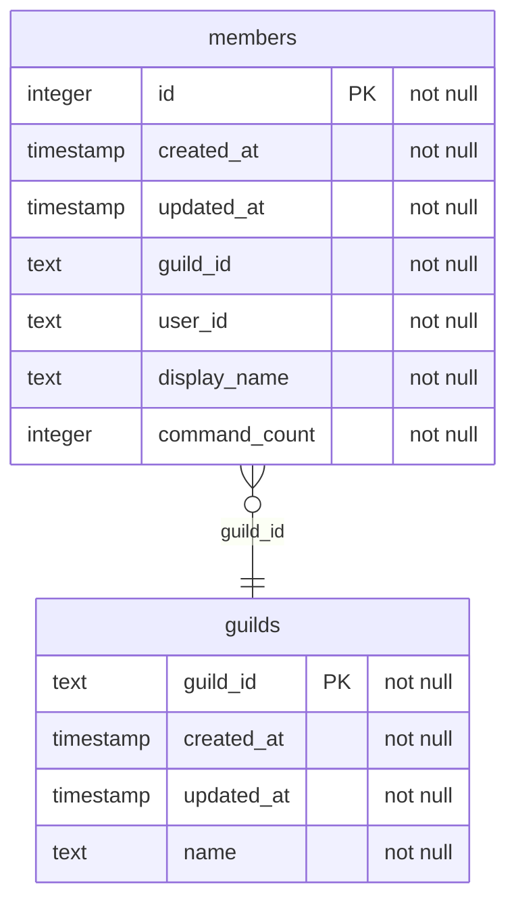

```mermaid
erDiagram
  guilds {
    text guild_id PK "not null"
    timestamp created_at "not null"
    timestamp updated_at "not null"
    text name "not null"
  }

  members {
    integer id PK "not null"
    timestamp created_at "not null"
    timestamp updated_at "not null"
    text guild_id "not null"
    text user_id "not null"
    text display_name "not null"
    integer command_count "not null"
  }

  members }o--|| guilds : "guild_id"
```
