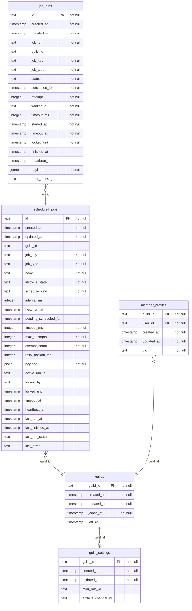

```mermaid
erDiagram
  guilds {
    text guild_id PK "not null"
    timestamp created_at "not null"
    timestamp updated_at "not null"
    timestamp joined_at "not null"
    timestamp left_at
  }

  guild_settings {
    text guild_id PK "not null"
    timestamp created_at "not null"
    timestamp updated_at "not null"
    text mod_role_id
    text archive_channel_id
  }

  job_runs {
    text id PK "not null"
    timestamp created_at "not null"
    timestamp updated_at "not null"
    text job_id "not null"
    text guild_id
    text job_key "not null"
    text job_type "not null"
    text status "not null"
    timestamp scheduled_for "not null"
    integer attempt "not null"
    text worker_id "not null"
    integer timeout_ms "not null"
    timestamp started_at "not null"
    timestamp timeout_at "not null"
    timestamp locked_until "not null"
    timestamp finished_at
    timestamp heartbeat_at
    jsonb payload "not null"
    text error_message
  }

  scheduled_jobs {
    text id PK "not null"
    timestamp created_at "not null"
    timestamp updated_at "not null"
    text guild_id
    text job_key "not null"
    text job_type "not null"
    text name "not null"
    text lifecycle_state "not null"
    text schedule_kind "not null"
    integer interval_ms
    timestamp next_run_at
    timestamp pending_scheduled_for
    integer timeout_ms "not null"
    integer max_attempts "not null"
    integer attempt_count "not null"
    integer retry_backoff_ms
    jsonb payload "not null"
    text active_run_id
    text locked_by
    timestamp locked_until
    timestamp timeout_at
    timestamp heartbeat_at
    timestamp last_run_at
    timestamp last_finished_at
    text last_run_status
    text last_error
  }

  member_profiles {
    text guild_id PK "not null"
    text user_id PK "not null"
    timestamp created_at "not null"
    timestamp updated_at "not null"
    text bio "not null"
  }

  guilds ||--o| guild_settings : "guild_id"
  job_runs }o--|| scheduled_jobs : "job_id"
  scheduled_jobs }o--|| guilds : "guild_id"
  member_profiles }o--|| guilds : "guild_id"
```
